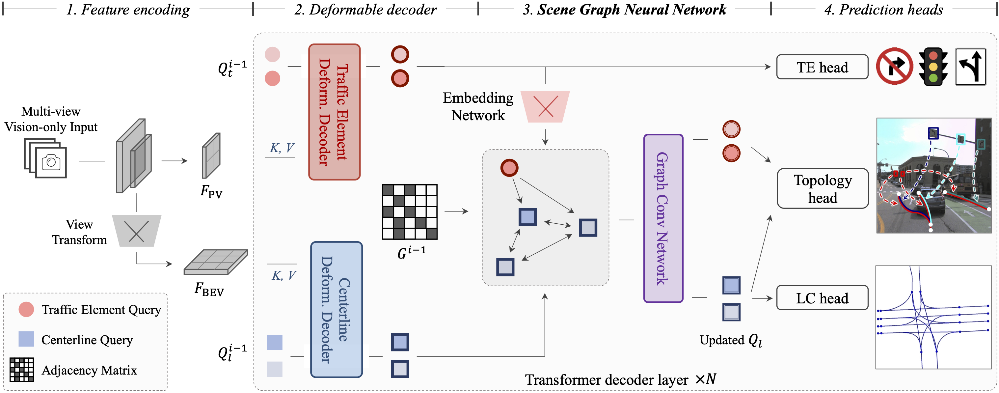

<div align="center">

# TopoNet: A New Baseline for Scene Topology Reasoning

## Graph-based Topology Reasoning for Driving Scenes

[](https://arxiv.org/abs/2304.05277)
[](https://github.com/OpenDriveLab/OpenLane-V2)
[](./LICENSE)




</div>

> - Production from [OpenDriveLab](https://opendrivelab.com). Jointly with our fellow collaborators at Huawei Noah's Ark Lab, Fudan University, and [HKU MMLab](http://luoping.me/).
> - Primary contact: [Tianyu Li](https://scholar.google.com/citations?user=X6vTmEMAAAAJ) ( litianyu@opendrivelab.com ) or/and [Li Chen](https://scholar.google.com/citations?user=ulZxvY0AAAAJ).

---

This repository contains the source code of **TopoNet**, [Graph-based Topology Reasoning for Driving Scenes](https://arxiv.org/abs/2304.05277).

TopoNet is the first end-to-end framework capable of abstracting traffic knowledge beyond conventional perception tasks, _i.e._, **reasoning connections between centerlines and traffic elements** from sensor inputs. It unifies heterogeneous feature
learning and enhances feature interactions via the graph neural network architecture and the knowledge graph design. 

Instead of recognizing lanes, we adhere that modeling the lane topology is `appropriate` to construct road components within the perception framework, to facilitate the ultimate driving comfort. 
This is in accordance with the [UniAD philosophy](https://github.com/OpenDriveLab/UniAD).

## Table of Contents
- [News](#news)
- [Main Results](#main-results)
- [Prerequisites](#prerequisites)
- [Installation](#installation)
- [Prepare Dataset](#prepare-dataset)
- [Train and Evaluate](#train-and-evaluate)
- [License](#license)
- [Citation](#citation)

## News

- **`Pinned:`** The [leaderboard](https://opendrivelab.com/AD23Challenge.html#openlane_topology) for Lane Topology Challenge is open for regular submissions year around. This Challenge **`would`** be back in 2024's edition.
- **`[2023/11]`** :fire:The code and model of OpenLane-V2 subset-B is released!
- **`[2023/08]`** The code and model of TopoNet is released!
- **`[2023/04]`** TopoNet [paper](https://arxiv.org/abs/2304.05277) is available on arXiv.
- **`[2023/01]`** Introducing [Autonomous Driving Challenge](https://opendrivelab.com/AD23Challenge.html) for Lane Topology at CVPR 2023.


## Main Results

### Results on OpenLane-V2 subset-A val

We provide results on **[Openlane-V2](https://github.com/OpenDriveLab/OpenLane-V2) subset-A val** set.

|    Method    | Backbone  | Epoch | DET<sub>l</sub> | TOP<sub>ll</sub> | DET<sub>t</sub> | TOP<sub>lt</sub> |   OLS    |
| :----------: | :-------: | :---: | :-------------: | :--------------: | :-------------: | :--------------: | :------: |
|     STSU     | ResNet-50 |  24   |      12.7       |       0.5        |      43.0       |       15.1       |   25.4   |
| VectorMapNet | ResNet-50 |  24   |      11.1       |       0.4        |      41.7       |       6.2        |   20.8   |
|    MapTR     | ResNet-50 |  24   |       8.3       |       0.2        |      43.5       |       5.8        |   20.0   |
|    MapTR*    | ResNet-50 |  24   |      17.7       |       1.1        |      43.5       |       10.4       |   26.0   |
| **TopoNet**  | ResNet-50 |  24   |    **28.6**     |     **4.1**      |    **48.6**     |     **20.3**     | **35.6** |

:fire:: Based on the updated `v1.1` OpenLane-V2 devkit and metrics, we have reassessed the performance of TopoNet and other SOTA models. For more details please see issue [#76](https://github.com/OpenDriveLab/OpenLane-V2/issues/76) of OpenLane-V2.

|    Method    | Backbone  | Epoch | DET<sub>l</sub> | TOP<sub>ll</sub> | DET<sub>t</sub> | TOP<sub>lt</sub> |   OLS    |
| :----------: | :-------: | :---: | :-------------: | :--------------: | :-------------: | :--------------: | :------: |
|     STSU     | ResNet-50 |  24   |      12.7       |       2.9        |      43.0       |       19.8       |   29.3   |
| VectorMapNet | ResNet-50 |  24   |      11.1       |       2.7        |      41.7       |       9.2        |   24.9   |
|    MapTR     | ResNet-50 |  24   |       8.3       |       2.3        |      43.5       |       8.9        |   24.2   |
|    MapTR*    | ResNet-50 |  24   |      17.7       |       5.9        |      43.5       |       15.1       |   31.0   |
| **TopoNet**  | ResNet-50 |  24   |    **28.6**     |     **10.9**     |    **48.6**     |     **23.8**     | **39.8** |

> *: evaluation based on matching results on Chamfer distance.  
> The result of TopoNet is from this repo.


### Results on OpenLane-V2 subset-B val

|    Method    | Backbone  | Epoch | DET<sub>l</sub> | TOP<sub>ll</sub> | DET<sub>t</sub> | TOP<sub>lt</sub> |   OLS    |
| :----------: | :-------: | :---: | :-------------: | :--------------: | :-------------: | :--------------: | :------: |
| **TopoNet**  | ResNet-50 |  24   |    **24.4**     |     **6.7**      |    **52.6**     |     **16.7**     | **36.0** |

> The result is based on the updated `v1.1` OpenLane-V2 devkit and metrics.  
> The result of TopoNet is from this repo.

## Model Zoo

| Model | Dataset | Backbone | Epoch |  OLS  | Memory | Config | Download |
| :---: | :-----: | :------: | :---: | :---: | :----: | :----: | :------: |
| TopoNet-R50 | subset-A | ResNet-50 | 24 | 39.8 | 12.3G | [config](projects/configs/toponet_r50_8x1_24e_olv2_subset_A.py) | [ckpt](https://huggingface.co/OpenDriveLab/toponet_r50_8x1_24e_olv2_subset_A/resolve/main/toponet_r50_8x1_24e_olv2_subset_A.pth) / [log](https://huggingface.co/OpenDriveLab/toponet_r50_8x1_24e_olv2_subset_A/resolve/main/20231017_113808.log) |
| TopoNet-R50 | subset-B | ResNet-50 | 24 | 36.0 | 8.2G  | [config](projects/configs/toponet_r50_8x1_24e_olv2_subset_B.py) | [ckpt](https://huggingface.co/OpenDriveLab/toponet_r50_8x1_24e_olv2_subset_B/resolve/main/toponet_r50_8x1_24e_olv2_subset_B.pth) / [log](https://huggingface.co/OpenDriveLab/toponet_r50_8x1_24e_olv2_subset_B/resolve/main/20231127_121131.log) |


## Prerequisites

- Linux
- Python 3.8.x
- NVIDIA GPU + CUDA 11.1
- PyTorch 1.9.1

## Installation

We recommend using [conda](https://docs.conda.io/en/latest/miniconda.html) to run the code.
```bash
conda create -n toponet python=3.8 -y
conda activate toponet

# (optional) If you have CUDA installed on your computer, skip this step.
conda install cudatoolkit=11.1.1 -c conda-forge

pip install torch==1.9.1+cu111 torchvision==0.10.1+cu111 -f https://download.pytorch.org/whl/torch_stable.html
```

Install mm-series packages.
```bash
pip install mmcv-full==1.5.2 -f https://download.openmmlab.com/mmcv/dist/cu111/torch1.9.0/index.html
pip install mmdet==2.26.0
pip install mmsegmentation==0.29.1
pip install mmdet3d==1.0.0rc6
```

Install other required packages.
```bash
pip install -r requirements.txt
```

## Prepare Dataset

Following [OpenLane-V2 repo](https://github.com/OpenDriveLab/OpenLane-V2/blob/v1.0.0/data) to download the data and run the [preprocessing](https://github.com/OpenDriveLab/OpenLane-V2/tree/v1.0.0/data#preprocess) code.

```bash
cd TopoNet
mkdir data && cd data

ln -s {PATH to OpenLane-V2 repo}/data/OpenLane-V2
```

After setup, the hierarchy of folder `data` is described below:
```
data/OpenLane-V2
├── train
|   └── ...
├── val
|   └── ...
├── test
|   └── ...
├── data_dict_subset_A_train.pkl
├── data_dict_subset_A_val.pkl
├── data_dict_subset_B_train.pkl
├── data_dict_subset_B_val.pkl
├── ...
```

## Train and Evaluate

### Train

We recommend using 8 GPUs for training. If a different number of GPUs is utilized, you can enhance performance by configuring the `--autoscale-lr` option. The training logs will be saved to `work_dirs/toponet`.

```bash
cd TopoNet
mkdir -p work_dirs/toponet

./tools/dist_train.sh 8 [--autoscale-lr]
```

### Evaluate
You can set `--show` to visualize the results.

```bash
./tools/dist_test.sh 8 [--show]
```

## License

All assets and code are under the [Apache 2.0 license](./LICENSE) unless specified otherwise.

## Citation
If this work is helpful for your research, please consider citing the following BibTeX entry.

``` bibtex
@article{li2023toponet,
  title={Graph-based Topology Reasoning for Driving Scenes},
  author={Li, Tianyu and Chen, Li and Wang, Huijie and Li, Yang and Yang, Jiazhi and Geng, Xiangwei and Jiang, Shengyin and Wang, Yuting and Xu, Hang and Xu, Chunjing and Yan, Junchi and Luo, Ping and Li, Hongyang},
  journal={arXiv preprint arXiv:2304.05277},
  year={2023}
}

@inproceedings{wang2023openlanev2,
  title={OpenLane-V2: A Topology Reasoning Benchmark for Unified 3D HD Mapping}, 
  author={Wang, Huijie and Li, Tianyu and Li, Yang and Chen, Li and Sima, Chonghao and Liu, Zhenbo and Wang, Bangjun and Jia, Peijin and Wang, Yuting and Jiang, Shengyin and Wen, Feng and Xu, Hang and Luo, Ping and Yan, Junchi and Zhang, Wei and Li, Hongyang},
  booktitle={NeurIPS},
  year={2023}
}
```

## Related resources

We acknowledge all the open-source contributors for the following projects to make this work possible:

- [Openlane-V2](https://github.com/OpenDriveLab/OpenLane-V2)
- [BEVFormer](https://github.com/fundamentalvision/BEVFormer)
